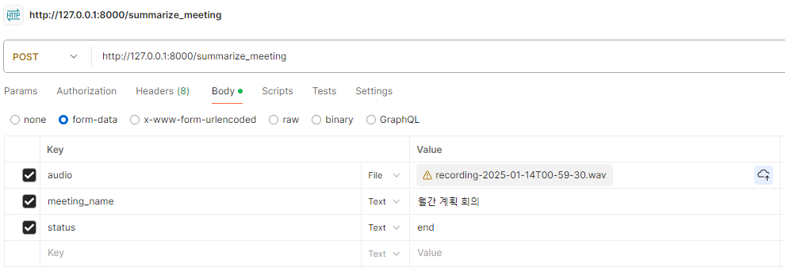

<head>
  <link rel="stylesheet" href="https://cdnjs.cloudflare.com/ajax/libs/font-awesome/5.15.4/css/all.min.css">
</head>

# AI 스마트 회의 어시스턴트 MATE  

## 📹Demo 시연


음성이 포함된 동영상은 다운로드 후 시청 부탁드립니다. [Full video](./sample_imgs/demo.mp4)

<br/>

## 실제 웹 서비스 제공 (~2025.02.25)

내부 사정으로 인해 상기 기간보다 조기에 서비스가 중단될 수 있습니다.

웹 서비스 링크: [MATE](https://mate-spring02-apfmbwa0hpg4e8aa.koreacentral-01.azurewebsites.net/)

<br/>

## 🗓 개발 기간

2025.01.02 ~ 2025.02.13


## 🤝 팀 구성

| 이름   | 주 업무 | Link |
|--------|---------|------|
| 이예림 | PL      |  <a href="https://github.com/lyrWinterCat">    |
| 안지홍 | FE      |  <a href="https://github.com/dnwn129">    |
| 이승은 | SE      |  <a href="https://github.com/Greeense">    |
| 고수현 | DB      |  <a href="https://github.com/csj8566">    |
| 윤찬혁 | AI      |  <a href="https://github.com/ChanhyukYun"> |
| 박언용 | BE      |  <a href="https://github.com/onionpark">    |


## 🗃 선정 배경

- 코로나가 창궐한 2020년 이후 온라인 화상 회의 시장 규모는 점진적으로 증가함

- 기존 온라인 회의 서비스는 실시간 요약 기능이나 회의록 저장 기능 등이 기본적으로 지원되지 않음

- 강남역 근처에서 93명에 대하여 설문조사 결과, 온라인 회의는 다음 문제가 있음

  > 1. 오프라인 회의 대비 집중하기 어려움
  > 2. 참가자 간 소통이 어려움
  > 3. 회의 내용 정리가 어려움

- 또한 온라인 회의 내용 정리는 대부분 직접 회의록을 필기하거나 문서 작성해서 이뤄지며 이에 불만이 많아, 회의 내용 자동 요약이 필요하다는 응답이 많았음

- 요약 기능 외에도 회의록 작성이나 공유 자료 요약 기능, 그리고 독성 발언 탐지 기능 또한 필요함


## 🛠 주요 서비스

1. 회의 내용 및 공유 자료 실시간 요약

2. 회의 내용 기반 ToDo List 제공

3. 연속 회의를 위한 이전 회의 정보 제공

4. 회의 중 참여자 피로탐지

5. 회의 중 독성 발언 탐지


## ⚡적용된 AI 기술

|   |          **AI 기술**         | **세부 내용**                                                        |
|---|:----------------------------:|----------------------------------------------------------------------|
| 1 | Faster-Whisper<br/>(Pre-trained) | - Speech-to-Text (STT) <br/>- API 기반 Whisper 대비 약 3배 빠른 추론 속도 |
| 2 |      GPT-4o<br/>(OpenAI API)     | - 텍스트 요약 <br/>- 이미지 요약                                          |
| 3 |    KoELECTRA<br/> (Fine-tuned)    | - 회의 음성 텍스트 중 독성 표현 (욕설, 비윤리적 발언) 탐지           |
| 4 |     Pyannote<br/> (Fine-tuned)    | - 회의 중 발화자 식별                                                |
| 5 |      YOLO11<br/> (Fine-tuned)     | - 회의 참여자 얼굴 기반 피로 탐지                                    |


## 📈 기대효과

#### 다양한 회의 피드백

- 좋은 성과를 낸 아이디어 제공자 식별 및 포상 가능

- 회의 중 독성 발언 감시로 건전한 회의 분위기 조성 가능

#### 업무 효율성 향상

- 회의 중 또는 이후 요약 기능 제공으로 원활한 회의 진행 및 복기 가능

- 주제별 요약 및 ToDo List 제공으로 불필요한 논의 최소화

#### 회의 스트레스 감소

- 집중도 저하 시 피로 탐지 기반의 적절한 휴식 권고로 밀도 있는 회의 진행 가능

- 회의 중 독성 발언으로 인한 감정적 스트레스 감소가 기대됨


## ⚙ 사용 방법

### 1. API 키 설정 및 Hugging Face 설정

OpenAI API Key를 ./fastAPI/my_openai_api.txt 에 저장

[Hugging Face 토큰 발급 가이드](https://kjh1337.tistory.com/3)를 참고하여 토큰을 발급받아 ./fastAPI/huggingFace_token.txt에 저장

[speaker-diarization-3.0](https://huggingface.co/pyannote/speaker-diarization-3.0), [segmentation](https://huggingface.co/pyannote/segmentation), [embedding](https://huggingface.co/pyannote/embedding)의 모델 사용 권한을 각각 받기

### 2. FastAPI

&emsp;**1. 가상환경 생성**
   
```(CMD)
conda create -y -n fastapi python=3.12.5
```

&emsp;**2. 가상환경 활성화**

```(CMD)
conda activate fastapi
```

&emsp;**3. 필요 라이브러리 설치**
```(CMD)
cd fastAPI
pip install -r requirements.txt
```

&emsp;**4. 발화자 식별을 위한 Pyannote 데이터 준비**  
&emsp;&emsp;준비물: 발화자별 음성파일, 음성파일 정보가 담긴 uem 파일, 발화자 정보가 담긴 rttm 파일, 데이터 경로가 담긴 yaml 파일

|   |          **파일 종류**         | **세부 내용**                                                        |
|---|:----------------------------:|----------------------------------------------------------------------|
| 1 | 음성 파일 | - mp4, wav 등 확장자의 음성 파일<br/>- ./fastAPI/voice 디렉토리 생성 후 해당 디렉토리에 음성파일 준비 |
| 2 |     [uem 파일](https://github.com/lyrWinterCat/MATE_Aivle_BP/blob/main/fastAPI/AI/speakerdiarization/pyannote/train/uem/train1.uem)     | {파일명} {시작시간} {끝나는시간} 형태로 데이터가 작성된 파일  |
| 3 |    [rttm 파일](https://github.com/lyrWinterCat/MATE_Aivle_BP/blob/main/fastAPI/AI/speakerdiarization/pyannote/train/rttm/train1.rttm)    | SPEAKER {파일명} 1 {시작시간} {음성길이} {발화자명} 형태로 데이터가 작성된 파일  |
| 4 |     [yaml 파일](https://github.com/lyrWinterCat/MATE_Aivle_BP/blob/main/fastAPI/AI/speakerdiarization/pyannote/database.yml)    | 데이터 (음성파일, uem, rttm)의 경로가 작성된 파일  |


&emsp;**5. FastAPI 실행**
```(CMD)
uvicorn main:app
```

&emsp;**5-1. FastAPI 테스트 시 주의사항**

&emsp;FastAPI endpoint들은 Form-data로 variable 값을 POST로 받게 설정됨

  - detect_fatigue: 피로도 측정해서 측정 결과를 보내주는 함수<br/>
      + 필요 variable: image<br/>
        - image: File / 온라인 회의 화면 이미지
  
  - summarize_screen: 공유된 화면의 내용을 정리해주는 함수<br/>
      + 필요 variable: image, meeting_name<br/>
        - image: File / 공유된 화면 이미지<br/>
        - meeting_name: string / 회의명
       
  - summarize_meeting: 휴식하기 or 회의종료를 눌렀을 때 4가지의 요약 및 발화자 구분을 해주는 함수<br/>
      + 필요 variable: audio, meeting_name, status<br/>
        - audio: File / 음성파일<br/>
        - meeting_name: string / 회의명<br/>
        - status: string / "ing" or "end" => 휴식하기를 눌렀을 때는 "ing", 회의종료를 눌렀을 때는 "end"로 받게 되어있음.
        
    


### 3. Spring

1. IntelliJ 실행 후 ./backend/MATE 를 프로젝트 폴더로 프로젝트 열기

2. build.gradle

3. 상기 프로젝트의 MATE/src/main/java/com/example/MATE/MateApplication 실행

### 4. 서비스

[사용설명서](./HOWTOUSE.md)


## 🤔새로 배울 수 있었던 점

- 웹 크롤링을 활용한 데이터 수집 및 이를 활용한 모델 학습

- Spring과 FastAPI 서버 간 음성·이미지 송·수신 구현 방법과, 그 과정에서 발생한 다양한 에러 해결

- 클라우드 지식을 활용하여 Azure DB를 사용해 로컬 개발 환경에서 데이터를 공통으로 사용

- 단순 AI 서비스 모델 개발하는 것이 아닌, 웹 서비스에서 기초로 요구하는 사항을 직접 공부하고 실현
